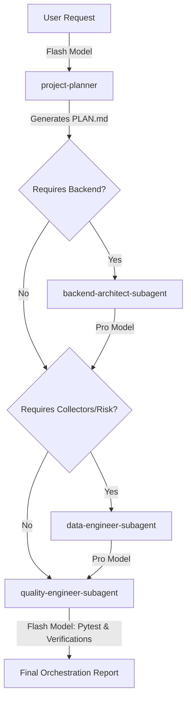

# Multi-Agent Orchestration Workflow

## 1. Purpose
Defines the sequential multi-agent execution pipeline when a large, complex, or multi-file feature is requested in the SilverPilot project. Coordinates specialised AI Coding Agents and local Antigravity Subagents to ensure minimal risk, token/cost optimization, and high implementation consistency.

## 2. Rules
- **Sequential Planning:** Always start with the `project-planner` before writing any backend, data, or quality code.
- **Strict Role Boundaries:** Each agent must only execute tasks within their defined responsibilities.
- **Subagent Context Separation:** Never perform extensive search, debugging, or parallel code-writing directly in the parent workspace if it clutters the conversation history. Always delegate to specialized subagents.
- **Interactive Model Selection:** Proactively suggest model transitions (Flash vs Pro) to the user based on task complexity.
- **Safety Gate:** The `quality-engineer` must define the verification steps and run validations before the final feature is reported as done.

## 3. Recommended Patterns

### Orchestration Sequence

### A. Local Subagent Delegation Policy
Antigravity supports spawning specialized subagents via `define_subagent` and `invoke_subagent`. To optimize context limits and keep conversations high-signal:
1. **Scouting & Research:** Delegate large codebase searches and API analyses to a read-only `scout-subagent`. The subagent compiles findings and sends a concise summary message back, saving thousands of tokens.
2. **Code Implementation:** For multi-file changes, spawn an isolated `backend-architect-subagent` or `data-engineer-subagent` using the `branch` or `share` workspace mode. This prevents intermediate compilation logs and temporary codes from bloating the main chat.
3. **Quality & Tests:** Spawn a `quality-subagent` to run pytest suites and environment smoke tests in the background.

### B. Model Cascading Playbook (Flash vs Pro)
To maximize token economy and quality, route tasks to the optimal model tiers:

| Tier | Model Target | Applicable Tasks | Trigger Rules |
| :--- | :--- | :--- | :--- |
| **Fast / Cheap** | Gemini 3.5 Flash | Codebase scouting, phase planning, running local tests, writing documentation, and formatting reports. | Active by default. The agent operates in this tier for all preliminary and verification phases. |
| **Deep Reasoning** | Gemini 3.5 Pro | Implementing complex multi-file structures, delicate database query optimization, Alembic migrations, and fixing logical bugs. | The agent stops and explicitly requests the user to switch to Gemini 3.5 Pro in the UI before starting execution. |

*How to request a transition:*
> *"Analiz ve altyapı hazırlığı tamamlandı. Şimdi [Uygulanacak Görev] aşamasına geçiyoruz. Muhakeme kalitesini maksimize etmek ve hata oranını düşürmek için lütfen sağ panelden modeli **Gemini 3.5 Pro** olarak değiştirin."*

---

## 4. Anti-Patterns
- **Direct Bloat:** Running extensive grep searches or viewing entire multi-thousand-line files directly in the main conversation context.
- **Model Overkill:** Running simple syntax checks or writing markdown document updates on expensive high-tier reasoning models.
- **Skipping Phase 1 (Planning):** Letting subagents write code without a structured and approved plan.

## 5. Checklist
- [ ] Has `project-planner` generated or updated a valid plan?
- [ ] Were heavy research/search tasks de-escalated to a dedicated `scout-subagent`?
- [ ] Did the agent prompt the user to switch to Gemini 3.5 Pro before writing critical production code?
- [ ] Did the agent prompt the user to switch back to Gemini 3.5 Flash before running tests or writing documentation?
- [ ] Have all pytest tests passed under the subagent's execution check?

## 6. Example Guidance
When a user requests a major feature like "Simulated portfolio risk warning when volatility exceeds 5%":
1. **Plan (Flash):** Use Gemini 3.5 Flash. Trigger `project-planner` to create a plan.
2. **Scout (Flash):** Spawn a `scout-subagent` to locate existing risk thresholds and sample feeds.
3. **Execute (Pro):** Ask the user to switch to Gemini 3.5 Pro. Spawn `data-engineer-subagent` and `backend-architect-subagent` to write volatility calculation logic and endpoints.
4. **Verify & Test (Flash):** Ask the user to switch back to Gemini 3.5 Flash. Spawn `quality-subagent` to run `pytest` and verify zero-regression.
5. **Report (Flash):** Compile and deliver a concise orchestration summary.
