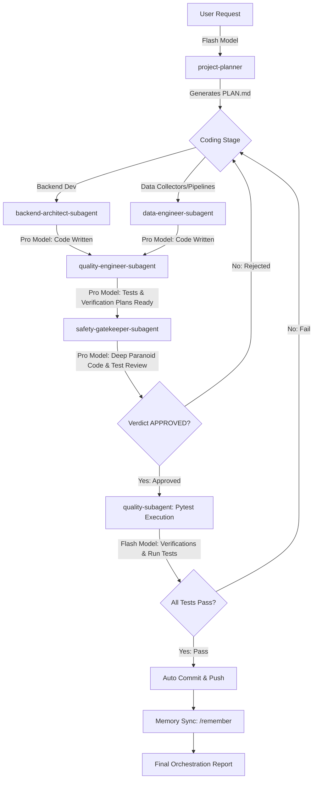

# /orchestrate - Multi-Agent Orchestration Workflow

$ARGUMENTS

---

## 1. Purpose
Defines the sequential multi-agent execution pipeline when a large, complex, or multi-file feature is requested in the SilverPilot project. Coordinates specialised AI Coding Agents and local Antigravity Subagents to ensure minimal risk, token/cost optimization, and high implementation consistency.

## 2. Rules
- **Sequential Planning:** Always start with the `project-planner` before writing any backend, data, or quality code.
- **Strict Role Boundaries:** Each agent must only execute tasks within their defined responsibilities.
- **Subagent Context Separation:** Never perform extensive search, debugging, or parallel code-writing directly in the parent workspace if it clutters the conversation history. Always delegate to specialized subagents.
- **Interactive Model Selection:** Proactively suggest model transitions (Flash vs Pro) to the user based on task complexity and agent requirements.
- **Safety Gate (Mandatory):** Before any code is merged, executed, or reported as complete, the `quality-engineer` must write the tests AND the `safety-gatekeeper` must perform a paranoid pre-execution review. Code must be approved by the `safety-gatekeeper` before actual test suite execution and final completion.
- **Auto Commit & Push (Mandatory):** If all code passes the static safety gate AND the active test suite executes successfully with zero errors/regressions, the agent **MUST** automatically commit and push the changes to avoid requiring manual git actions from the user.
- **Infinite Loop Protection (Döngü Sınırı ve Güvenli Durma):** Kod yazımı, güvenlik kontrolü veya test çalıştırma aşamaları üst üste **3 kez başarısız olursa** orchestrator döngüyü sürdürmemelidir. Akışı durdurup `debugger-agent`'a geçiş yapmalı, 5 Neden analiziyle hata raporunu derlemeli ve kullanıcıya Socratic kapı üzerinden açıklama sorarak devretmelidir.
- **Port ve Git Kısıtları Uyum Güvencesi:** Yazılan kodun VPS Port İzolasyonuna (veritabanı işlemleri sadece FastAPI HTTP uç noktaları üzerinden) uyduğundan emin olunmalıdır. Ayrıca, otomatik commit işlemi sırasında yerel `pre-commit` (Ruff format ve lint) kancasının tetikleneceği unutulmamalı; eğer commit ruff hatalarından dolayı reddedilirse bu durum yakalanıp otomatik düzeltilmelidir.

---

## 3. Recommended Patterns

### Orchestration Sequence

### Orchestration Sequences by Task Type (Göreve Özel Orkestrasyon Sıraları)

Görevin türüne göre orkestrasyon hattına dahil olacak ajanların sırası ve sorumluluk geçişleri değişiklik gösterir:

#### 1. Yeni Özellik Geliştirme (Feature Development Pipeline)
Amacı sisteme yeni bir kabiliyet veya modül eklemektir:
`project-planner` (Plan & DoD) $\rightarrow$ `scout-agent` (Keşif) $\rightarrow$ `backend-architect` (Şema & API) veya `data-engineer` (Kollektör & Matematik) $\rightarrow$ `quality-engineer` (Test Tasarımı) $\rightarrow$ `safety-gatekeeper` (Statik Güvenlik & Doğrulama) $\rightarrow$ `quality-engineer` (Testlerin Çalıştırılması) $\rightarrow$ `/remember` (Hafıza Eşleme).

#### 2. Hata Ayıklama (Bug Fix Pipeline)
Amacı var olan bir hatayı veya testi izole edip kalıcı olarak çözmektir:
`project-planner` (Plan) $\rightarrow$ **`debugger-agent` (5 Neden Analizi, Hata İzolasyonu & Reproduce)** $\rightarrow$ `backend-architect` veya `data-engineer` (Düzeltme Kodu) $\rightarrow$ `quality-engineer` (Regresyon Önleyici Testler) $\rightarrow$ `safety-gatekeeper` (Statik Güvenlik Onayı) $\rightarrow$ `quality-engineer` (Pytest Çalıştırma) $\rightarrow$ **`/remember` (feedback-history.md güncellemesi)**.

#### 3. Kod Yenileme & Göç (Refactoring & Migration Pipeline)
Amacı legacy kodları (Hermes göçü vb.) Strangler Fig ile bozmadan taşımaktır:
`project-planner` (Plan) $\rightarrow$ **`archaeologist-agent` (Eski Kod Analizi, Chesterton Fence Denetimi & Strangler Fig Tasarımı)** $\rightarrow$ `backend-architect` (Yeni Modül & Temiz Arayüz) $\rightarrow$ `quality-engineer` (Karakterizasyon & Golden Master Testleri) $\rightarrow$ `safety-gatekeeper` (Bağlaşım [Coupling] ve Mimari Denetim) $\rightarrow$ `quality-engineer` (Test Çalıştırma) $\rightarrow$ `/remember` (tech-decisions.md güncellemesi).

#### 4. Güvenlik Sıkılaştırması (Security Hardening Pipeline)
Amacı OWASP 2025 açıklarını tespit etmek ve kapatmaktır:
`project-planner` (Plan) $\rightarrow$ **`security-auditor` (Sızma/Zafiyet Analizi, Secrets denetimi & IDOR kontrolü)** $\rightarrow$ `backend-architect` (Güvenli Parametrik Sorgular & Auth Dependency) $\rightarrow$ `quality-engineer` (Negatif Test Senaryoları) $\rightarrow$ `safety-gatekeeper` (Zero-Trust API Sınır Denetimi) $\rightarrow$ `quality-engineer` (Test Çalıştırma) $\rightarrow$ `/remember` (feedback-history.md veya tech-decisions.md güncellemesi).

---

### A. Local Subagent Delegation Policy
Antigravity supports spawning specialized subagents via `define_subagent` and `invoke_subagent`. To optimize context limits and keep conversations high-signal:
1. **Scouting & Research:** Delegate large codebase searches and API analyses to a read-only `scout-subagent`. Enforce the usage of `@global-chat-agent-discovery` and `@jq` for parsing schemas.
2. **Code Implementation:** For multi-file changes, spawn an isolated `backend-architect-subagent` or `data-engineer-subagent` using the `branch` or `share` workspace mode. This prevents intermediate compilation logs and temporary codes from bloating the main chat.
3. **Quality & Test Design:** Spawn a `quality-subagent` to write clean, AAA pattern test files. Utilize `@lambdatest-agent-skills` or `@k6-load-testing` where load/E2E test automation is necessary.
4. **Safety & Code Review:** Spawn a `safety-gatekeeper-subagent` (running Gemini 3.5 Pro) to review the written code changes and test cases *statically* before any execution. Enforce strict static rules utilizing `@logic-lens` (formal verification reasoning), `@brooks-lint` (coupling analysis), and `@codebase-audit-pre-push`.
5. **Quality & Test Execution:** Run the `pytest` test suites and environment smoke tests in a green, isolated terminal session, validated by `@squirrel` for a perfect delivery pipeline.

### B. Model Cascading Playbook (Flash vs Pro)
To maximize token economy and quality, route tasks to the optimal model tiers:

| Tier | Model Target | Applicable Tasks | Trigger Rules |
| :--- | :--- | :--- | :--- |
| **Fast / Cheap** | Gemini 3.5 Flash | Codebase scouting, phase planning, running local tests, writing documentation, and formatting reports. | Active by default. The agent operates in this tier for all preliminary and verification phases. |
| **Deep Reasoning** | Gemini 3.5 Pro | Implementing complex multi-file structures, delicate database query optimization, Alembic migrations, fixing logical bugs, and **paranoid pre-execution static code reviews (`safety-gatekeeper`)**. | The agent stops and explicitly requests the user to switch to Gemini 3.5 Pro in the UI before starting code writing or safety review. |

*How to request a transition:*
> *"Analiz ve altyapı hazırlığı tamamlandı. Şimdi [Geliştirme / Güvenlik Geçidi] aşamasına geçiyoruz. Muhakeme kalitesini maksimize etmek ve karmaşık mantıksal hataları önlemek için lütfen sağ panelden modeli **Gemini 3.5 Pro** olarak değiştirin."*

### C. Automated Git Commit & Push Policy (Otomatik Git Commit ve Push Politikası)
To save user overhead and ensure a streamlined delivery cycle, git tasks are automatically handled:
1. **Scope Phase:** Stage only the files associated with the active plan/phase using target files or `git add [file]`. Never do blanket stage (`git add .`) if there are unwanted dirty scratch files.
2. **Commit Standard:** Formulate structured messages following the Conventional Commits specification:
   - `feat: [description]` for new features
   - `fix: [description]` for bug fixes
   - `docs: [description]` for documentation changes
   - `refactor: [description]` for code changes that neither fix a bug nor add a feature
   - `chore: [description]` for auxiliary task updates (framework adjustments, dependencies)
3. **Push Automation:** Once the commit is created, automatically execute `git push` in the workspace repository. If the push encounters authorization or upstream branch errors, report them clearly to the user.

---

## 4. Anti-Patterns
- **Direct Bloat:** Running extensive grep searches or viewing entire multi-thousand-line files directly in the main conversation context.
- **Model Overkill:** Running simple syntax checks or writing markdown document updates on expensive high-tier reasoning models.
- **Skipping Phase 1 (Planning):** Letting subagents write code without a structured and approved plan.
- **Shallow Tests:** Approving test cases that mock away all complex logic or only test standard happy-paths without validation by the `safety-gatekeeper`.
- **Manual Git Friction:** Leaving modified files staged or unstaged, forcing the user to type git commands manually to commit the successful results.

---

## 5. Checklist
- [ ] Has `project-planner` generated or updated a valid plan?
- [ ] Were heavy research/search tasks de-escalated to a dedicated `scout-subagent`?
- [ ] Did the agent prompt the user to switch to Gemini 3.5 Pro before writing critical production code?
- [ ] Have proposed code changes and test cases been reviewed and **Approved** by a `safety-gatekeeper-subagent` using the Gemini 3.5 Pro model?
- [ ] Did the agent prompt the user to switch back to Gemini 3.5 Flash before running tests or writing documentation?
- [ ] Have all pytest tests passed under the subagent's execution check?
- [ ] **[Git Automation]** Are all successful changes committed via Conventional Commits and pushed automatically to the remote repository?
- [ ] **[Memory Sync]** Has the `/remember` workflow been triggered to persist learning outcomes and completed milestones in the developer memory?

---

## 6. Example Guidance
When a user requests a major feature like "Simulated portfolio risk warning when volatility exceeds 5%":
1. **Plan (Flash):** Use Gemini 3.5 Flash. Trigger `project-planner` to create a plan.
2. **Scout (Flash):** Spawn a `scout-subagent` to locate existing risk thresholds and sample feeds.
3. **Execute Code (Pro):** Ask the user to switch to Gemini 3.5 Pro. Spawn `data-engineer-subagent` and `backend-architect-subagent` to write volatility calculation logic and endpoints.
4. **Execute Tests (Pro):** Spawn `quality-subagent` to write robust, realistic test suites with mock cash limits.
5. **Safety Gate (Pro):** Spawn `safety-gatekeeper-subagent` to statically inspect code and tests under paranoid scenarios. Issue the final `APPROVED` verdict.
6. **Verify & Test (Flash):** Ask the user to switch back to Gemini 3.5 Flash. Spawn `quality-subagent` to run `pytest` and verify zero-regression.
7. **Commit & Push (Flash):** Stage the changed code and test files (`git add ...`), commit with `feat: add volatility-based portfolio risk checks`, and immediately run `git push`.
8. **Memory Sync (Flash):** Trigger the `/remember` workflow to save learnings and completed phase details in Geliştirme Belleği (`.agent/memory/`).
9. **Report (Flash):** Compile and deliver a concise orchestration summary.
