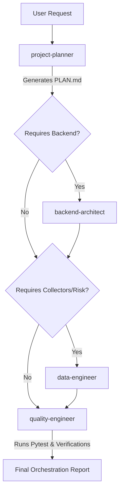

# Multi-Agent Orchestration Workflow

## 1. Purpose
Defines the sequential multi-agent execution pipeline when a large, complex, or multi-file feature is requested in the SilverPilot project. Coordinates specialised AI Coding Agents to ensure minimal risk and high implementation consistency.

## 2. Rules
- **Sequential Planning:** Always start with the `project-planner` before writing any backend, data, or quality code.
- **Strict Role Boundaries:** Each agent must only execute tasks within their defined responsibilities.
- **Safety Gate:** The `quality-engineer` must define the verification steps and run validations before the final feature is reported as done.

## 3. Recommended Patterns

### Orchestration Sequence

1. **Phase 1: Task Analysis & Decomposition**
   - Active Agent: `project-planner.md`
   - Action: Analyze user goals, identify dependencies, check existing database schema/endpoints, and generate/update a structured `PLAN.md` with explicit milestones.
2. **Phase 2: Backend Architecture & API Design**
   - Active Agent: `backend-architect.md`
   - Action: Design and write FastAPI endpoints, Pydantic schemas, and SQLAlchemy ORM models as outlined in `PLAN.md`.
3. **Phase 3: Data Pipelines & Simulated Calculations**
   - Active Agent: `data-engineer.md`
   - Action: Build/update financial collectors (FRED, RSS, TCMB) and code paper-trading risk analysis metric equations.
4. **Phase 4: Testing & System Verification**
   - Active Agent: `quality-engineer.md`
   - Action: Write automated pytest test cases (`test_*.py`), verify Docker Compose containers, inspect CI/CD configurations, and execute verification plans.
5. **Phase 5: Output & Reporting**
   - Active Agent: Orchestrator / Lead AI
   - Action: Report final outcome mapping touched files, manual test suggestions, regression risks, and a concise diff summary.

## 4. Anti-Patterns
- Skipping Phase 1 (Planning) and letting `backend-architect` write code without a structured `PLAN.md`.
- Permitting `backend-architect` or `data-engineer` to self-approve and merge code without `quality-engineer` verification.

## 5. Checklist
- [ ] Has `project-planner` generated or updated a valid `PLAN.md`?
- [ ] Did `backend-architect` verify queries avoid the N+1 problem?
- [ ] Did `data-engineer` verify that zero real-money interfaces were created?
- [ ] Have all pytest tests passed under `quality-engineer` direction?
- [ ] Is the final Output Report structured according to TIER 0 guidelines?

## 6. Example Guidance
When a user requests a major feature like "Simulated portfolio risk warning when volatility exceeds 5%":
1. Trigger `project-planner` to create `PLAN.md` dividing tasks into db structure, volatility check formulas, api alert endpoint, and pytest tests.
2. Trigger `data-engineer` to implement volatility calculations based on 24h prices.
3. Trigger `backend-architect` to build the GET warning status API.
4. Trigger `quality-engineer` to write tests for high-volatility scenarios.
5. Compile and deliver the Orchestration Report.
